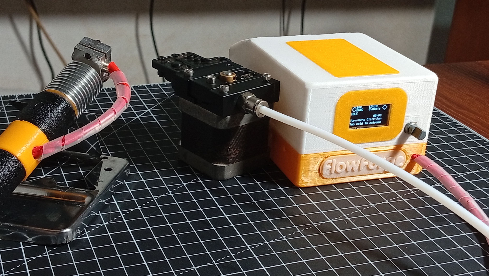

# FlowForge

[](https://youtu.be/iGiAu_VeJ9w)


**An open-source 3D printing pen built entirely from waste.**

A handheld filament extrusion pen assembled from parts rescued from a decommissioned FDM 3D printer — hot end, nozzle, extruder mechanism, NEMA 17 stepper, PTFE tube and the printer's own Arduino Mega + RAMPS controller — and fed with filament drawn from discarded PET bottles. Every printed structural part is designed to print on the same recycled filament the pen itself consumes.

Waste plastic becomes a tool that draws in waste plastic.

## Repository layout

| Path | Contents |
|---|---|
| `firmware/` | PlatformIO project — Arduino Mega 2560 + RAMPS 1.6. See [`firmware/README.md`](firmware/README.md) |
| `stl/` | Printable parts: electronics unit enclosure and pen assembly |
| `doc/` | Project documentation and publication plan |


## The system

<p align="center">
  
</p>

Three units, not one object:

1. **The pen** — hot end, nozzle and vented barrel in a heat-isolated handle. No electronics beyond the heater cartridge, thermistor and fan.
2. **The electronics unit** — a 120 × 80 mm desktop wedge housing the Mega + RAMPS, the extruder stepper and driver, the OLED and the rotary encoder. Filament enters at the rear and leaves through a PTFE tether to the pen.
3. **A 24 V bench supply.**

## Firmware at a glance

Closed-loop PID hotend control with Marlin-style thermal-runaway protection, an acceleration-ramped extruder, and a single-knob menu UI on a 128 × 64 OLED.

```sh
cd firmware
pio run              # build
pio run -t upload    # build + flash over USB
```

Safety behaviour worth knowing before you power one on:

- **The machine boots idle** — target 0 °C, motor disabled. Nothing heats until you set a target.
- **The motor will not start below 170 °C** (cold-extrusion interlock).
- **Four independent thermal faults latch until power cycle**: sensor open/short, over-temperature ceiling (260 °C), no-rise watchdog while heating, and post-settle drift watchdog.
- **Long-press the encoder from anywhere** for an immediate motor stop.

Full detail in [`firmware/README.md`](firmware/README.md).

## Licence

CERN-OHL-S v2 (hardware) · MIT (firmware).

## Status

Pre-publication. The documentation carries **[MEASURE]** markers wherever bench data is still outstanding — see the *Document maintenance* section at the end of `doc/flowforge-documentation.md` for the current list of unresolved items.
